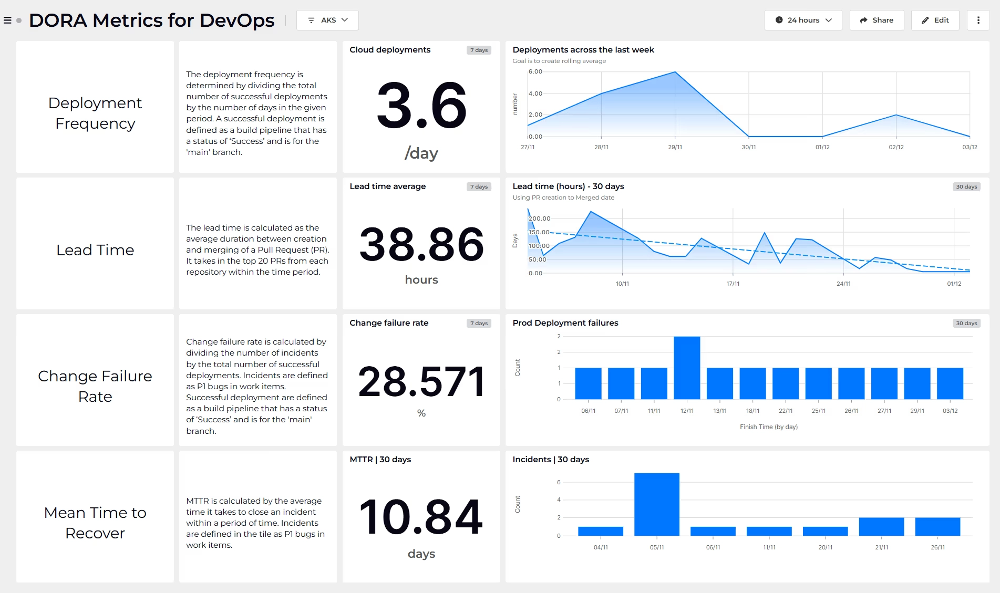
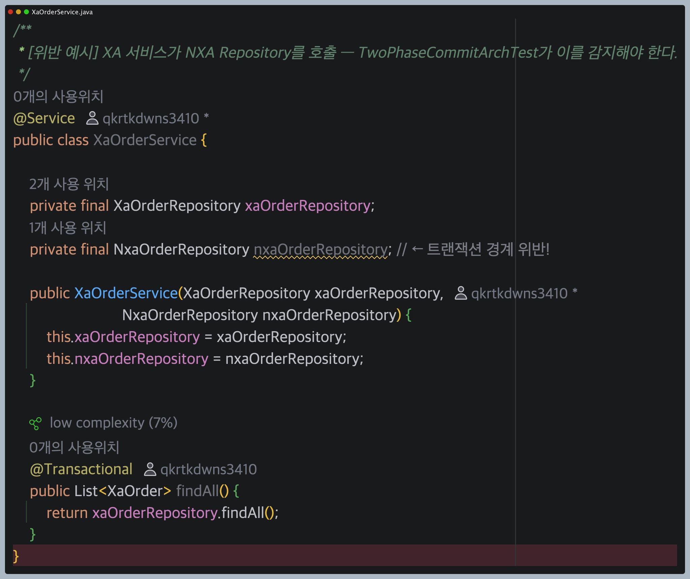
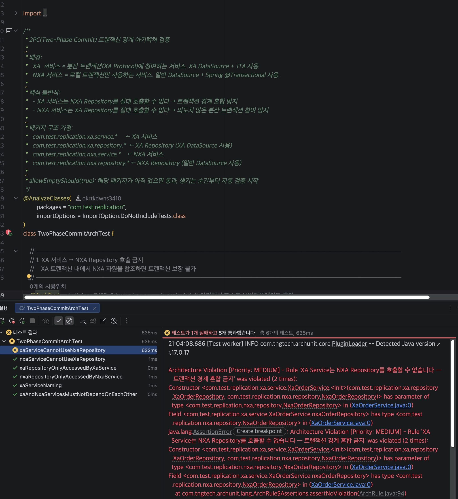

## 1. 2026 소트웍스 기술 레이더

- 2026년 4월 기준 문서
    - AI 가 소프트웨어의 복잡성을 가속화하는 중이라 평가
    - `인재 부채`를 경고
        - 엔지니어링적 기초로 회귀하여 기초를 다시 다져야함을 강조함.
- 원칙
    1. 원칙을 유지할 것
        1. 페어 프로그램이나, 제로 트러스트, DORA 메트릭 등 검증된 기법을 AI 시대에 유지해야함

           > 제로 트러스트
           >
           > - 재택과 클라우드가 늘어남으로 `회사 내부망` 의 개념이 무너짐으로 등장
               >     - 3가지 원칙을 항상 지킨다
               >         1. 명확하게 검증할것 : 사용자 아이디뿐만 아니라, 접속 기기 - 위치- 시간 까지 매번 꼼곰하게 확인한다
               >         2. 최소 권한 부여 : 개발자에게 AWS 관련 매트릭만 오픈하고 나머지 LB 등은 주지 않음
               >         3. 침해 가정 : `이미 우리 네트워크에 해커가 들어와 있다` 라고 가정하고 감시망을 상시 가동
           >
           > DORA 메트릭
           >
           > 
           >
           > - 구글의 DORA ( DevOps Research and Assessment ) 연구팀의 조사 결과
               >     - 성공하는 소프트웨어 개발 팀은 딱 이 4가지 지표가 뛰어났음
           >
           > | 구분 | 지표 이름 | 설명 |
           > | --- | --- | --- |
           > | 속도 | 배포 빈도 | 새로운 기능이나 수정사항을 사용자에게 얼마나 자주 출시하는지 |
           > | 속도 | 변경 리드 타임 | 개발자가 코드를 다 작성한 순간부터 실제 서비스에 반영되기까지 얼마나 걸리는지 |
           > | 안정성 | 변경 실패율 | 배포한 시스템 100번 중 버그나 장애가 발생해 긴급 수정해야 했던 비율이 얼마인지 |
           > | 안정성 | 서비스 복구 시간 | 실제 서비스에 장애가 발생하는 경우, 다시 정상화하는 데 얼마나 걸리는지? |
        2. 빠른 코드 생성이 쉬워질 수록 규율있는 엔지니어링이 중요하다.
    2. 권한 과다 에이전트 보안
        1. AI 에이젖트는 광범위한 데이터 접근이 필요해서 보안 리스트가 있음
    3. 코딩 에이전트 하네스
        1. 에이전트 스킬
        2. 자동 피드백 관련 방식으로 에이전트 동작을 제어해야함
            1. 리뷰 게이트웨이 등의 기술을 말하는듯 팀 자체적인
    4. 에이전틱 시대의 기술 평가
        1. 낮은 진입 장벼으로 개발 도구가 폭증..
            1. AI 가 코딩해주니까 대단한 코딩 실력 없어도, 누구나 그럴싸한 개발 도구나 오픈소스 라이브러리를 만들어 출시가 가능해짐
            2. 회사에서 AI 로 3일만엔 대충 만든 장난감 같은 도구나 전문가들이 3년간 치열하게 고민해서 만든 탄탄한 도구가
               겉 보기에는 똑같이 매우 좋은 도구로 적혀 있음.
                1. 이제는 단어의 의미 자체가 너무 가벼워짐.. ( Semantic Diffusion )
            3. 겉으로는 이제 평가가 너무 어려워졌음.
- 기술 부분으로 채택된 것 중에 눈여겨 볼만한것
    - Context Engineering
        - LLM 에 전달하는 컨
- 도구 부분으로 채택
    - Claude code
    - Cursor
- 플랫폼
    - 채택된것은 없지만 새로 시도해볼만한 것에
        - AWS Bedrock AgentCore
        - **Graphiti**
            - AI 에이전트를 위한 시간 인식 지식 그래프 ( Knowledge Graph )
            - 그냥 AI 에이전트를 위해 이전에 대화기록 등을 그래프 형태로 기록 → 자동 추출 Neo4J (그래프 DB) 에 저장하고
            - 에이전트가 과거 맥락을 시점 기준으로 조회할 수 있게 해주는 거임
            - 장기기억이 필요한 경우 사용
            - 랭체인에서 보통 사용
        - **Langfuse**
            - LLM 어플 전용
            - 어떤 프롬프트가 잘 되는지.. 토큰 비용이 얼마인지 추척하고 싶을때 사용한다고 함.
            - 랭체인에서 보통 사용
    - 가 등재
- 언어와 프레임워크
    - Apache Iceberg
        - 대규모 분석 워크로드를 위한 Open Table Format 이라는데 잘 모르겠음
    - React JS 나 Native
    - 스벨트
    - Typer
        - 파이썬 타입 힌트만으로 CLI 를 만든느 라이브러리임
        - 파이썬 스크립트를 CLI 툴로 빠르게 포장할때 사용하는 것

## 2. ArchUnit

- 2.5 챕터에서의 `자동화` 관련 부분에서 ArchUnit 이라는 라이브러리가 등장함
- 궁금해서 찾아봄
- 역할
    - 아키텍처를 코드가 지키는 하는 테스트 코드라고 생각하면됨.
    - 아키텍처 규칙 같은 경우에 보통 위키나 문서에 텍스트로만 존재함.
    - 문서는 사실 잘 안지켜짐.. 코드 리뷰단계에서 놓치게 되는데
        - `테스트 코드` 로 만들어서 CI 가 자동으로 잡게 하는 방법이 있음.
- 아키텍처가 무너지는 경우
    - 모듈 A → B → A 순환 참조하는 경우
    - Controller 에서 Repository 를 직접 호출하지 않기로 했는데 호출 하는 경우
    - ArchUnit 이 있다면
        - 위반 코드가는 git push 하면 CI 빌드가 실패함 ( 물론 자동 CI 되지 않는 경우 테스트 코드를 직접 돌려야하긴함 )
            - 검증계 올리는 경우에는 CI 를 보통 돌리니까 거기서 실패하긴할거임
        - 리뷰어의 경험에 의존 하지 않고
        - 전체 코드 베이스 100% 스캔이 가능함
- 2PC 트랜잭션이 존재하느 경우
    - 사실 눈으로 찾는게 아닌 이상은 발견도 겁나 힘듬.
- 사용법
    - 라이브러리 추가

        ```
        dependencies {
            // test scope — 프로덕션 코드에 영향 없음
            testImplementation 'com.tngtech.archunit:archunit-junit5:1.3.0'
        }
        ```

    - 2PC 트랜잭션 경계 검증
        - XA 서비스와 NXA 서비스가 있는 경우
            - xa → 분산 트랜잭션 참여, JTA + XA 데이터 소스 사용
            - nxa → 로컬 트랜잭션만. 일반 Datasoruce 사용
        - 경계가 섞이는 경우 트랜잭션 보장이 깨지게 된다.
            - 런타임에서 발견시 재현이 엄청 어려운 문제가 있음.
        - 실제 패키지 구조

            ```
            com.test.replication
            ├── xa/
            │   ├── service/   XaOrderService
            │   ├── repository/XaOrderRepository
            │   └── entity/    XaOrder
            └── nxa/
                ├── service/   NxaOrderService
                ├── repository/NxaOrderRepository
                └── entity/    NxaOrder
            ```

        - 테스트 코드

            ```
            // XA → NXA 호출 금지
            @ArchTest
            static final ArchRule xaCannotUseNxa =
                noClasses().that()
                    .resideInAPackage("..xa.service..")
                    .should().dependOnClassesThat()
                    .resideInAPackage("..nxa.repository..")
                    .allowEmptyShould(true);
            
            // NXA → XA 호출 금지
            @ArchTest
            static final ArchRule nxaCannotUseXa =
                noClasses().that()
                    .resideInAPackage("..nxa.service..")
                    .should().dependOnClassesThat()
                    .resideInAPackage("..xa.repository..")
                    .allowEmptyShould(true);
            ```

        - 프로덕션 코드

          

        - 실제 테스트 결과

          
