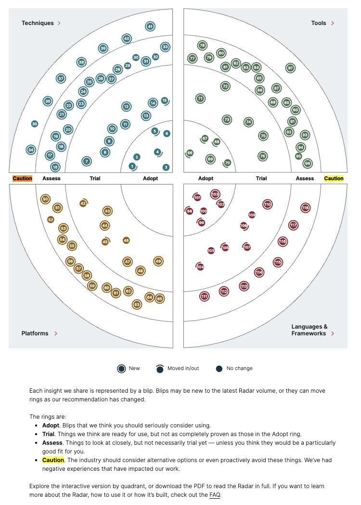
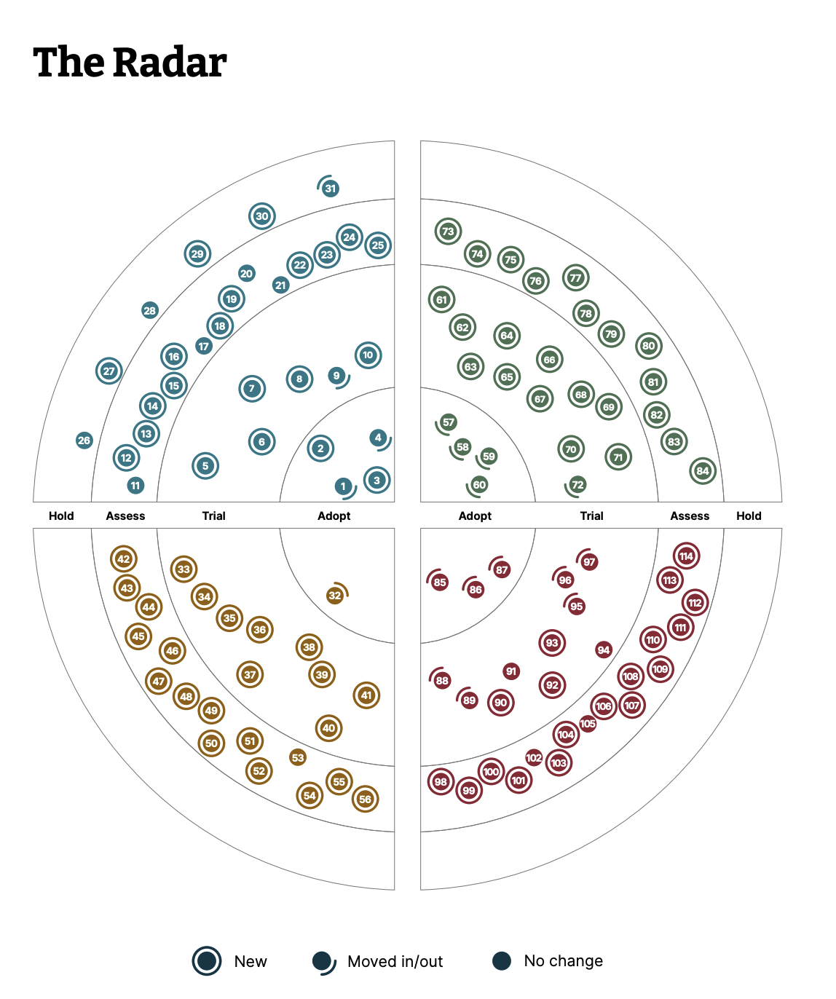

# ThoughtWorks Technology Radar

> "An opinionated guide to today's technology landscape"<br>
> 오늘 날의 기술 지형에 대한, 의견이 담긴 가이드 : 우리가 직접 써봤고, 이게 맞다고 본다. 중립적인 척은 안할게. 

---

## 먼저, 이건 기술 트렌드 기사가 아니다

가트너 하이프 사이클처럼 "요즘 이게 뜨고 있어요" 같은 중립적 관찰 보고서가 아니다.  
ThoughtWorks가 실제 클라이언트 프로젝트에서 **직접 써보고, 실패도 해보고, 검증한 것**들에 대한 주관적 판단이다.

핵심 철학은 하나다: **"우리가 지금 이 기술에 대해 어떤 포지션을 취하는가"**

---

## 구조: 4개 Ring × 4개 Quadrant

### Rings (안쪽에서 바깥쪽 순서)
#### [radar link](https://www.thoughtworks.com/en-us/radar)
* spring 같이 업계 표준으로 자리잡아 더이상 논할 필요없는건 다루지 않음 (당연한 소리지푷) 

| Ring | 의미 |
|------|------|
| **Adopt** | 지금 당장 써도 된다. 업계 전반이 도입해야 한다고 확신하는 것 |
| **Trial** | 리스크를 감당할 수 있는 프로젝트에서 역량을 쌓을 가치가 있는 것 |
| **Assess** | 우리 조직에 어떤 영향을 줄지 이해하기 위해 탐색할 것 |
| **Caution** | 중대한 우려가 있다. 특정 맥락에서 신중히 평가하거나 적극적으로 피하라 |



> **Vol.34부터 `Hold` → `Caution`으로 이름이 바뀌었다.**  
> 단순히 "보류" 수준이 아니라, 부정적 경험 기반의 더 강한 경고 의미로 강화된 것.
> 개인적으로 Caution 을 훨씬더 관심있게 볼것 같다. 

**Caution에 대한 흔한 오해:**  
이미 쓰고 있는 것을 당장 버리라는 게 아니다. "새로 도입하거나 확장하지 말라"는 포지션이다.  
특히 Vol.34에서는 antipattern 성격의 blip들이 여기 대거 진입했다.

### Quadrants (4등분된 구역)

- **Techniques** — 개발 방법론, 아키텍처 패턴, 실천법
- **Platforms** — 클라우드, 인프라, 플랫폼
- **Tools** — 개발 도구, CLI, SaaS 도구
- **Languages & Frameworks** — 언어, 프레임워크, 라이브러리

하나의 기술이 여러 Quadrant에 걸칠 수 있지만, 가장 적합한 하나로만 분류한다.

---

## Blip이란?

Radar에 올라오는 항목 하나하나를 **blip**이라고 부른다.  
Blip은 정적이지 않다. 매 volume마다 ring이 바뀌고, 새로 등장하거나 사라진다.

이 이동 방향이 중요하다:
- Assess → Trial → Adopt 로 올라온다면: "점점 확신이 생기고 있다"
- Trial → Caution 으로 내려간다면: "써봤는데 실제로 문제가 있더라"
- 처음부터 Caution으로 등장한다면: "이건 antipattern으로 본다"
- 사라진다면: "더 이상 언급할 필요 없을 만큼 당연해졌거나, 관심 밖이 됐다"

---

## 발행 주기

1년에 2회, 약 4~5월과 10~11월.  
2010년 ThoughtWorks 내부 기술 토론 메모에서 시작해 현재 Vol.34 (2026년 4월) 까지 이어졌다.  
매 volume당 약 100여 개의 blip, 지금까지 총 1,000개 이상의 기술이 다뤄졌다.

---

## Vol.34 (2026.04) 주목할 흐름

이번 edition의 핵심 메시지: **"AI가 복잡성을 가속화하고 있다. 그래서 오히려 기본기로 돌아가야 한다."**

AI 도구가 코드를 점점 더 많이 생성할수록, 아무도 시스템 전체를 이해하지 못하는 상태 — **Codebase Cognitive Debt** — 가 쌓인다.
이번 Radar는 그 경고이자 처방이다.

### Techniques Adopt 예시

| Blip | 한 줄 요약 |
|------|-----------|
| `Context engineering` | Vol.33 Assess에서 한 volume 만에 Adopt로. 프롬프트 문구가 아닌, context window 자체를 설계 대상으로 보는 것 |
| `Curated shared instructions for software teams` | AI 프롬프트를 개인 자산이 아닌 팀 공유 엔지니어링 자산으로 관리 |
| `DORA metrics` | AI 시대에 "코드 줄 수 = 생산성" 착각을 깨는 카운터웨이트로 재소환 |
| `Passkeys` | FIDO2 기반 비밀번호 대체. 이제 구현 난이도도 낮아져 기본값으로 쓸 만한 단계 |
| `Structured output from LLMs` | LLM 응답을 JSON 등 정해진 포맷으로 강제하는 것. 신뢰할 수 있는 AI 통합의 기본 |
| `Zero trust architecture` | 에이전트 보안 문제가 부각되면서 다시 강조 |

### Techniques Caution (신규 진입, 핵심)

| Blip | 왜 Caution인가 |
|------|---------------|
| `Codebase cognitive debt` | AI 생성 코드가 쌓이면서 팀이 시스템을 이해 못 하게 되는 현상 자체를 경고 |
| `Coding throughput as a measure of productivity` | PR 수, 커밋 수로 AI 시대 생산성을 측정하는 것은 잘못된 지표 |
| `Coding agent swarms` | 여러 에이전트를 무분별하게 병렬로 돌리는 것. 조율 없는 swarm은 오히려 위험 |
| `MCP by default` | MCP를 모든 곳에 디폴트로 적용하는 관행. 보안·복잡성 고려 없이 무지성 도입 경계 |
| `Agent instruction bloat` | 에이전트 프롬프트/인스트럭션이 비대해지면서 오히려 성능이 저하되는 것 |
| `AI-accelerated shadow IT` | GenAI로 팀 승인 없이 빠르게 뭔가 만들어버리는 것 (Vol.33에서 이어짐) |
| `Ignoring durability in agent workflows` | 에이전트 워크플로우에서 실패/재시도/상태 관리를 고려하지 않는 것 |

### Tools Adopt

- `Claude Code`, `Cursor` — 이제 공식적으로 Adopt 단계 !!

###  OpenClaw는 Rings의 tools중 유일하게 Caution에 위치함.
```text
openclaw가 caution 인 이유.

OpenClaw는 WhatsApp/iMessage 같은 메신저로 항상 연결되어 있는 개인 AI 어시스턴트 
캘린더, 이메일, 파일, 대화 기록까지 다 연동해서 쓸수록 점점 더 똑똑해지는 구조.
근데 Caution인 이유가 바로 그 구조 자체
유용해지려면 권한을 많이 줘야 하고, 권한을 많이 줄수록 리스크가 커지는 딜레마. 
문서에서 "permission-hungry"라고 표현한 이유 — 쓸만한 에이전트일수록 모든 걸 접근해야 한다는 구조적 모순.
특히 이전에 Radar에서 Caution으로 올린 Toxic flow analysis for AI — 민감한 데이터 + 외부 액션 + 신뢰할 수 없는 입력이 한 에이전트에 몰리는 패턴 — 의 교과서적인 사례가 OpenClaw
OpenClaw만의 문제가 아니라 이 패턴 자체가 위험하다는 게 ThoughtWorks의 포지션이다. 
대형 벤더가 만들어도 같은 위험이 있다고 명시함
```

---

## 그래서 이걸 어떻게 쓰냐?

### 1. 기술 선택의 기준으로

새 프로젝트에서 기술 스택을 고민할 때 "이게 지금 어느 ring이지?"는 유의미한 질문이다.  
맹신은 금물이다. ThoughtWorks의 context(대형 엔터프라이즈, 컨설팅 중심)가 내 팀과 다를 수 있다.

### 2. Breadth를 체계적으로 유지하는 도구로

책에서 Neal Ford가 언급한 이유 :   
아키텍트는 모든 기술을 깊게 알 수 없다. 하지만 "이 기술이 지금 어디쯤 있는지"를 아는 것 자체가 architectural thinking의 실천이다.

### 3. 팀 내 기술 토론의 공통 언어로

"우리가 쓰는 기술이 지금 Caution이야 Trial이야?"라는 질문은 팀 내 기술 방향 토론을 구체화하는 데 도움이 된다.  
특히 Caution 진입 blip은 "왜 우리는 이걸 쓰고 있는가"를 되묻게 만드는 좋은 계기가 될것 같다.

### 4. 나만의 Radar 만들기

ThoughtWorks는 Build Your Own Radar 도구도 공개하고 있다.  
팀에서 "우리 조직의 기술 포지션"을 직접 정의해보는것도 의미 있을것 같다.

---

## 한계

- ThoughtWorks의 클라이언트 포트폴리오 기반이라, **엔터프라이즈 / 컨설팅 맥락** 편향이 있다
- 스타트업이나 소규모 팀에는 Adopt 기준이 과할 수 있다
- 모든 기술이 다 올라오지 않는다. 올라오지 않았다고 나쁜 기술이 아니다
- Vol.34에서 지적했듯, 평가 자체가 어려워지고 있다 — AI로 만들어진 1인 유지보수 툴이 폭발적으로 늘면서 "성숙했는지 아닌지" 판단이 점점 더 어려워지는 중

---

### 2025.11 Vol33 버전의 radar

#### [vol33_radar_Link](https://www.thoughtworks.com/content/dam/thoughtworks/documents/radar/2025/11/tr_technology_radar_vol_33_en.pdf)


## 보는 곳

- 인터랙티브: [radar.thoughtworks.com](https://radar.thoughtworks.com)
- 전 volume 아카이브 + 이동 이력: [radar.setchy.io](https://radar.setchy.io)